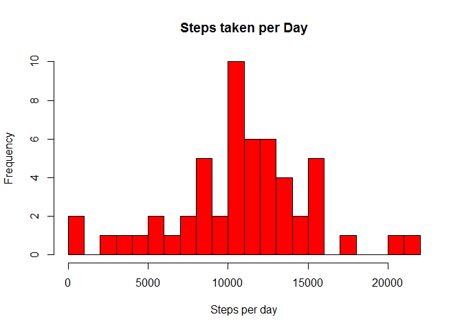
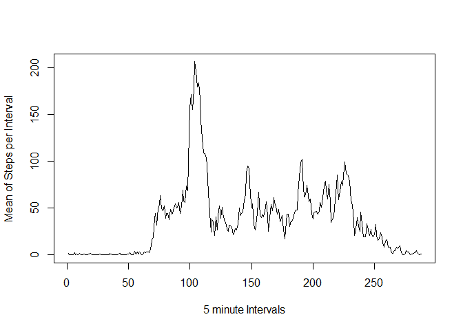
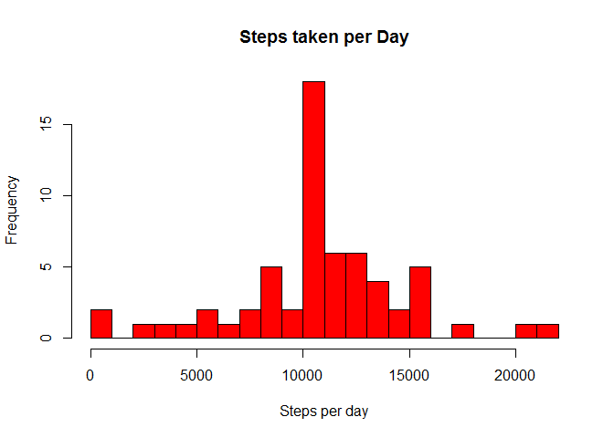
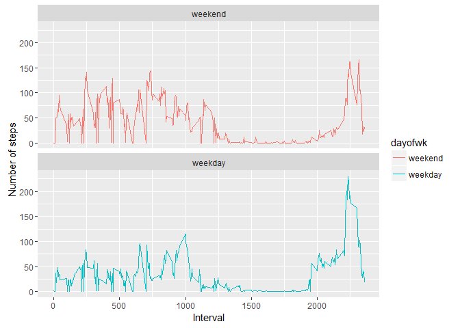

# Reproducible Research: Peer Assessment 1


## Loading and preprocessing the data

- **Set the working directory.**
- **Perform some functions to get a look at the data.**
- **Transform the interval column and get unique values for interval for later use.**

```r
    setwd("C:\\Users\\frase\\Documents\\GitHub\\RepData_PeerAssessment1")
    ## File was previously unzipped
    file1 <- read.csv("activity.csv", stringsAsFactors = FALSE,colClasses = "character" ,na.strings = "NA" )
    ## view some information about the data
    dim(file1)
```

```
## [1] 17568     3
```

```r
    str(file1)
```

```
## 'data.frame':	17568 obs. of  3 variables:
##  $ steps   : chr  NA NA NA NA ...
##  $ date    : chr  "2012-10-01" "2012-10-01" "2012-10-01" "2012-10-01" ...
##  $ interval: chr  "0" "5" "10" "15" ...
```

```r
    head(file1)
```

```
##   steps       date interval
## 1  <NA> 2012-10-01        0
## 2  <NA> 2012-10-01        5
## 3  <NA> 2012-10-01       10
## 4  <NA> 2012-10-01       15
## 5  <NA> 2012-10-01       20
## 6  <NA> 2012-10-01       25
```

```r
   ## transform the interval column for later use
   Intervals <- as.numeric(file1$interval)   
   ## get unique values for intervals for later use
   intervalsu <- unique(Intervals)
```


## What is mean total number of steps taken per day?

- **Calculate the number of steps taken per day using the tapply function to sum by the date as variable StepsPerDay.**
- **Create a histogram using the StepsPerDay variable. I chose to use breaks=25 and the color red.**
- **Calculate the mean of the StepsPerDay variable, removing NAs - I got *10766.19.***
- **Calculate the median of the StepsPerDay variable, removing NAs - I got *10765.***


```r
   ## histogram of steps taken per day
    ## dates <- unique(as.Date(as.factor(file1$date)))
    StepsPerDay <-  tapply(as.numeric(file1$steps),file1$date,sum)
    hist(StepsPerDay,col="red",xlab="Steps per day",main="Steps taken per Day",breaks=25)   
```



```r
    ## calculate the Mean of the Steps per Day
    StepsPerDayMean <- mean(StepsPerDay,na.rm=T)
    ## calculate the median of the Steps per day
    StepsPerDayMedian <- median(StepsPerDay, na.rm=T)
    
    StepsPerDayMean
```

```
## [1] 10766.19
```

```r
    StepsPerDayMedian
```

```
## [1] 10765
```

## What is the average daily activity pattern?

- **Make a time series plot of the 5-minute interval (x-axis) and the average number of steps taken, averaged across all days**


```r
    ##find the mean (average) for each interval across all days
    StepsPerIntervalMean <- tapply(as.numeric(file1$steps),Intervals,mean,na.rm=T)
    ## make a time series plot of the 5 minute intervals and the 
    ## average number of steps across all days.
    plot(StepsPerIntervalMean,type="l",xlab="5 minute Intervals",ylab="Mean of Steps per Interval")
```



- **Which 5-minute interval contains the maximum number of steps?**
  - The value was ***835*** (element 104) 


```r
    ## find the interval with the max number of steps
    StepsPerIntervalMax <- which.max(tapply(as.numeric(file1$steps),Intervals,sum,na.rm=T))
    StepsPerIntervalMax
```

```
## 835 
## 104
```

- **for my own information, what were the maximum number of steps **
  - I got ***835*** as the interval for ***10927*** steps


```r
    ## how many steps for the max interval?
    StepsPerIntervalSum <- tapply(as.numeric(file1$steps),Intervals,sum,na.rm=T)
    StepsPerIntervalSum[StepsPerIntervalMax]
```

```
##   835 
## 10927
```


## Imputing missing values

1. **Calculate the total number of missing values in the dataset**
   - The value was ***2304*** rows with missing values in the steps column.
   - There were no missing values in the date or interval columns.


```r
    ## calculate the number of rows with missing values
    ## there are 2304 rows with missing Steps, no rows with missing interval or date
    MissingSteps <- sum(is.na(file1$steps))
    MissingSteps
```

```
## [1] 2304
```

```r
    MissingInterval <- sum(is.na(file1$interval))
    MissingInterval
```

```
## [1] 0
```

```r
    MissingDates <- sum(is.na(file1$date))
    MissingDates
```

```
## [1] 0
```
  
2. **Fill in the missing values with the mean value for the particular interval**

3. **Create a new dataset equal to the original but with the missing data filled**  

```r
    ## replace the MIssing steps with the mean for that 5 minute interval
    file1replace <- file1
    ## the following line gets a warning but seems to work
    file1replace$steps[which(is.na(file1replace$steps))] <- StepsPerIntervalMean[file1replace$interval]
```

```
## Warning in file1replace$steps[which(is.na(file1replace$steps))] <-
## StepsPerIntervalMean[file1replace$interval]: number of items to replace is
## not a multiple of replacement length
```

 4. **Make a histogram of the total number of steps taken each day**
    - Report the mean and median total number of steps per day.
    - Do these values differ from the first part of the assignment?
      - Both the mean and median for this set of data were ***10766.19***, the same as the mean of the original data.
    - ***There seemed to be very little impact from imputing the missing data for the estimates of total daily number of steps.***


```r
    ## make a histogram of this new dataset
    StepsPerDay1 <-  tapply(as.numeric(file1replace$steps),file1replace$date,sum)
    hist(StepsPerDay1,col="red",xlab="Steps per day",main="Steps taken per Day",breaks=25)   
```



```r
    ## calculate the Mean of the Steps per Day
    StepsPerDayMean1 <- mean(StepsPerDay1,na.rm=T)
    ## calculate the median of the Steps per day
    StepsPerDayMedian1 <- median(StepsPerDay1, na.rm=T)
    
    StepsPerDayMean1
```

```
## [1] 10766.19
```

```r
    StepsPerDayMedian1
```

```
## [1] 10766.19
```
         
## Are there differences in activity patterns between weekdays and weekends?
 
 1. **create a new variable in the file1replace dataset to identify the date as a weekday or weekend day**
    - Subset the dataframe into weekday and weekend data frames.
    - Calculate the mean of the steps for each interval using tapply, removing NAs.
    - Create dataframes from the above step, which creates arrays.
    - Concatenate the two dataframes into one for plotting.
 

```r
  ## add a column for weekday  or weekend 
   file1replace <- within(file1replace, {dayofwk = ifelse(weekdays(as.Date(date,"%Y-%m-%d")) == "Saturday" | weekdays(as.Date(date,"%Y-%m-%d")) == "Sunday","weekend","weekday")})

   ## subset file1replace based on day of week
   file1wkdays <- subset(file1replace,dayofwk=="weekday")
   file1wkends <- subset(file1replace,dayofwk=="weekend")
   ## take the mean of the steps per interval for weekend and weekday dataframes
   wkdays <- tapply(as.numeric(file1wkdays$steps),file1wkdays$interval,mean,na.rm=TRUE)
   wkends <- tapply(as.numeric(file1wkends$steps),file1wkends$interval,mean,na.rm=TRUE)
   ## create dataframes out of the mean step values for plotting purposes
   we <- data.frame(intervalsu,as.numeric(wkends),"weekend")
   wd <- data.frame(intervalsu,as.numeric(wkdays),"weekday")
   names(wd) <-c("interval","steps","dayofwk")
   names(we) <-c("interval","steps","dayofwk")
   ## concatenate the two dataframes
   wewd <- rbind(we,wd)
```

 2. **Make a panel plot containing a time series plot of the 5-minute interval (x-axis) and the average number of steps taken**
    - Average these across all weekday days or weekend days (y-axis).
    - Make the plot look as close as possible to the example given.
    - save the plot to a png file.


```r
  ## plot using ggplot
   library(ggplot2)
```

```
## Warning: package 'ggplot2' was built under R version 3.2.3
```

```r
   ggplot(data=wewd, aes(x=interval, y=steps, colour = dayofwk)) + xlab("Interval")+ 
                      ylab("Number of steps") + geom_line() +
                      facet_grid(dayofwk ~ .,labeller=label_parsed)+facet_wrap(~ dayofwk,ncol=1)
```



```r
   ggsave(file="wewd.png",width=5, height = 5)
   dev.off()
```

```
## null device 
##           1
```

